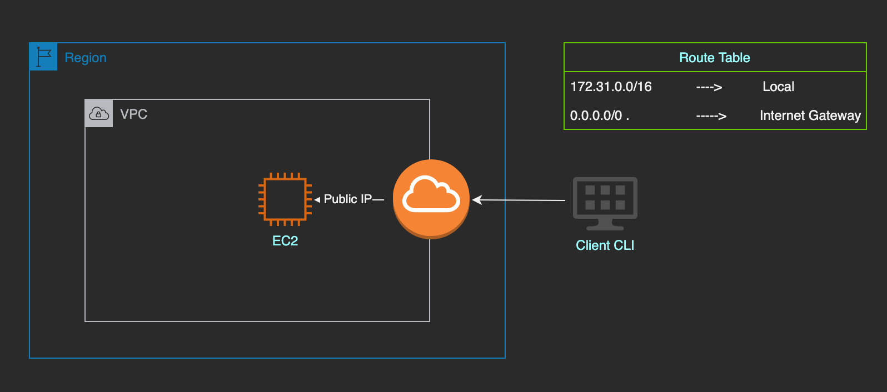
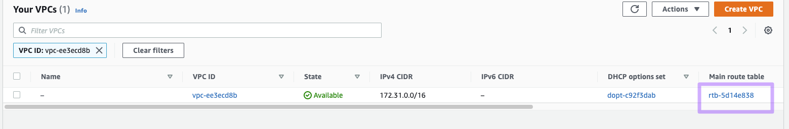
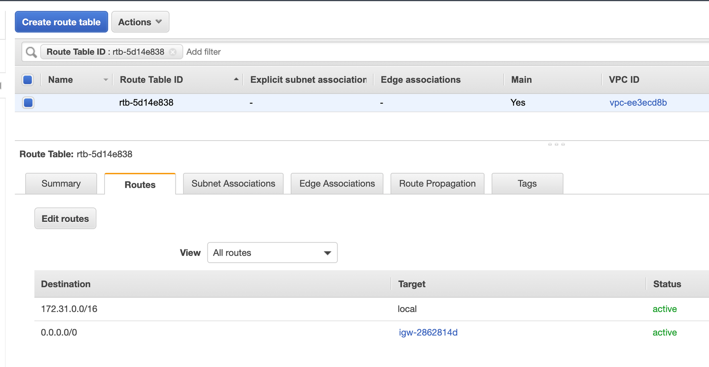
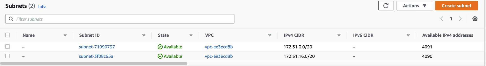
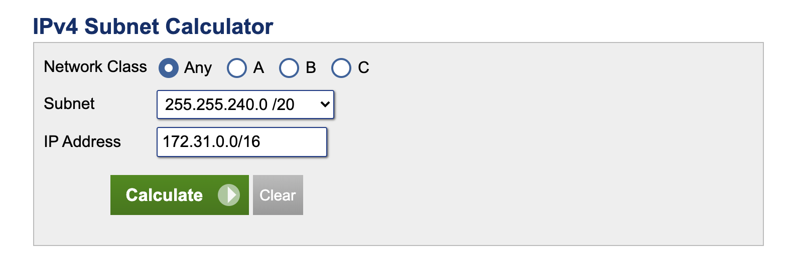
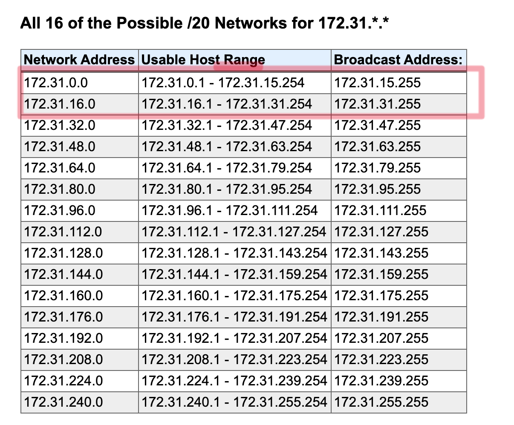

---
layout: post
title: "AWS Essentials : AWS Private Subnet and NAT"
description: "AWS Private Subnet and NAT"
date:   2020-01-03
tags: [AWS]
comments: false
references: [
   "Iam : https://aws.amazon.com/iam/",
   
]
---  

The objective of this post is to get a good understanding on Private subnets and NAT in AWS. We will see how to create a private subnet and add NAT support for the private subnet.

Let us start with a clean slate. When ever you create an EC2 Instance in a particular region, AWS creates following services in the background for us. 

1. A default VPC.
2. Public Subnets. (1 public subnet per AZ in that region)
3. A default route table. (Main route table)
4. An Internet Gateway, with updated entries in the Route table.
   
By default, the EC2 Instance we create will be in one of this particular public subnet.   

Given below shows my default VPC.  

Given below shows my main/default route table associated with the VPC and you can see the routes associated with the main route table as mentioned above.

My region is N. California and by default it comes with two AZ's and hence 2 public subnets as shown below.   

As shown above our VPC has a CIDR block (172.31.0.0/16). That means first 16 bits represents the network address and next 16 bits can be host part and hence there can be upto 2^16 hosts connected to it. 

 But since we divide those network into multiple subnets and we took 4 bytes to represent the subnet , that means we can have up to (2^4= 16 subnets) and each subnet can have (2^12 = 4096) hosts connected to it.  (Amazon don't allows subnets with all 0's and 1's. So actual hosts we can connect is 2^12 - 5)

In our region we have two AZ's and hence it shows two subnet, but we can have more subnets if needed.  If you use an IP calculator, you can see various possible subnets you can create in this network.  

As you can see the first two are already assigned to our existing subnets and we can use the next 12 available subnets.

Now if you check we have only 1 route table associated with our VPC and they are configured as following.  This default route table created is called as Main route table and all subnets are by default associated with this main route table.  But if you check the routes of main route table, you can see an Internet Gateway is attached to that route. (That means if we want to create a private subnet we need to create a new route table).  

