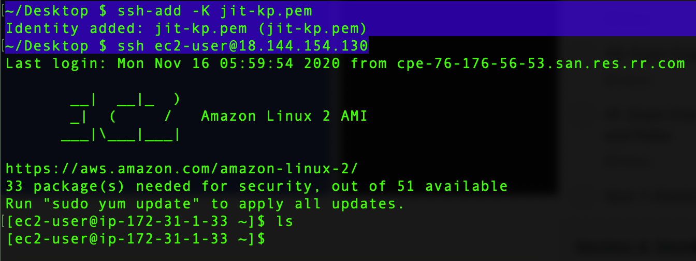

---
layout: post
title: "AWS Essentials : Bastion Hosts"
description: "AWS Bastion Hosts"
date:   2020-01-04
tags: [AWS]
comments: false
references: [
   "Iam : https://aws.amazon.com/iam/",
   
]
---  

In our previous post, we created a private instance. In this post we will see how we can connect to the private host by creating a Bastion Host. Lets get started. 

So in-order to connect to a private instance, we first need a public instance running in our VPC. First we need to connect to this public instance and from this public instance we need to connect to the private instance. Now this public host is called as a Bastion Host or Jumper host.  

But we know that, in-order to connect to an EC2 instance , we need to provide the key pair file and storing key pairs in a public instance is not secure.In order to SSH with out key pair file, first we need to add the Key pair file into our SSH, so that for further connection we don't need to pass this key pair.  Once added you can easily SSH into your public EC2 Instance with easy ssh command as shown below. 



The above step, enable us to access the public instance with out mentioning a key pair file. But for making this public instance a Bastion, we need to ssh into this public instance with Agent forwarding as shown below and then SSH into the private instance.

```bash
~/Desktop $ ssh -A ec2-user@18.144.60.58  # Agent forwarding to public instance
[ec2-user@ip-172-31-26-93 ~]$ ssh ec2-user@172.31.33.202  # ssh to private inst.
```
Now we are in a private instance from our local machine. Now let us try to ping outside world from this private instance and see what happens. 

```bash

[ec2-user@ip-172-31-33-202 ~]$ ping www.google.com
PING www.google.com (216.58.194.196) 56(84) bytes of data.

```
The PING will fail, since there is no Internet Gateway associated with this private instance. But internet access is a must for the private instance too right ? In order to download updates, install softwares etc.   

In our next post, we will see how we can securely add Internet access to the private instance using NAT (Network Address Translator)