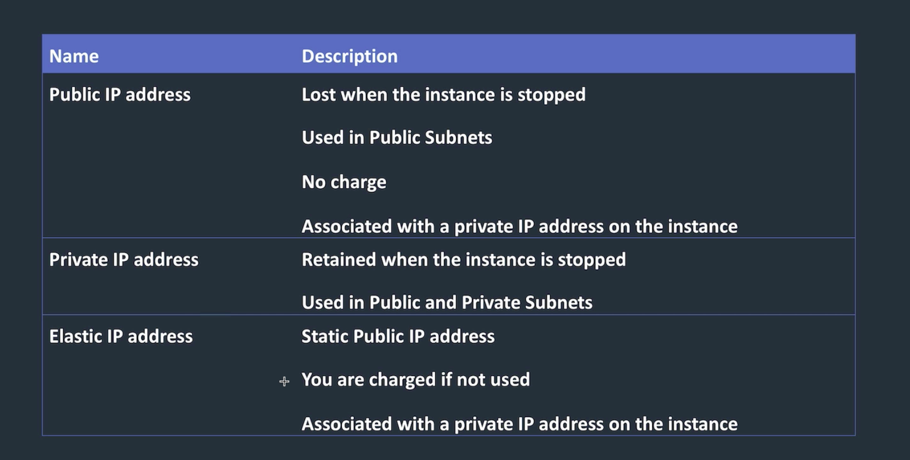
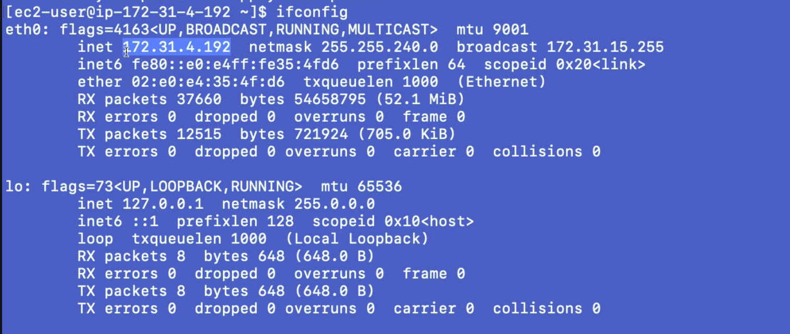
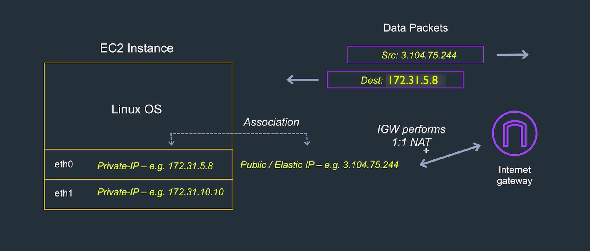
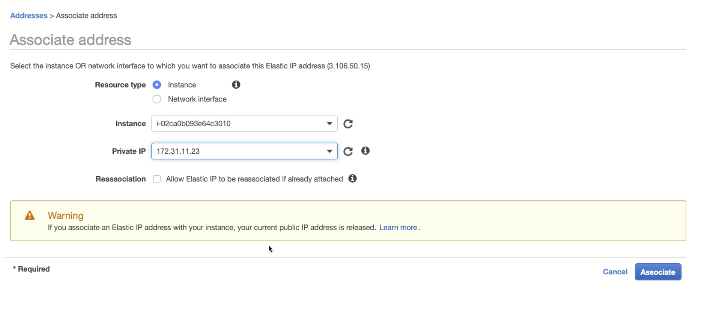
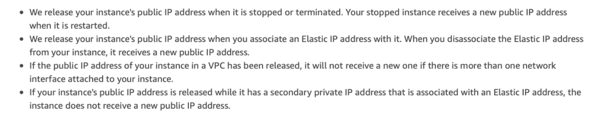
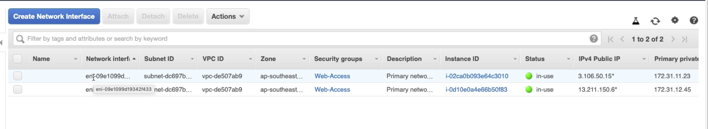
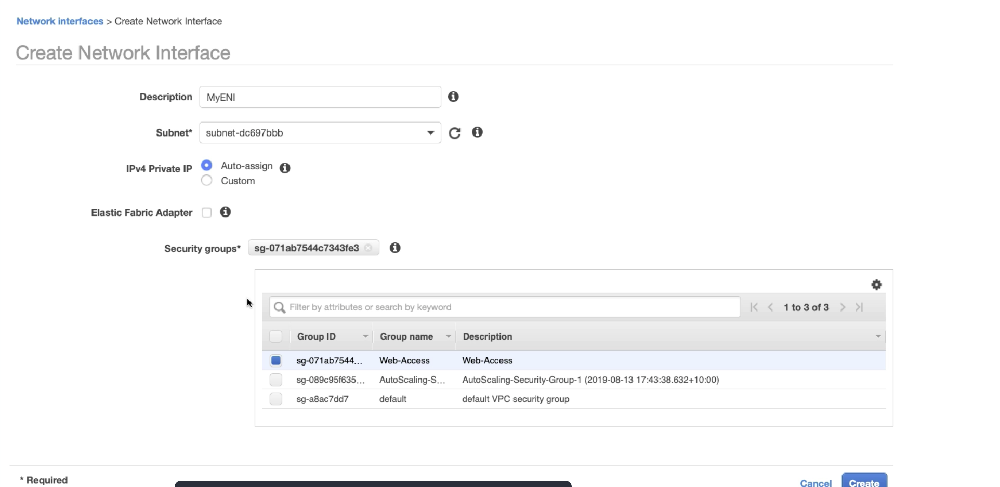
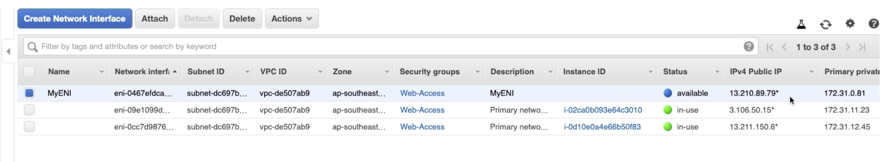

---
layout: post
title: "AWS Essentials : Elastic IP"
description: "AWS Elastic IP"
date:   2020-01-05
tags: [AWS]
comments: false
references: [
   "Iam : https://aws.amazon.com/iam/",
   
]
---  

In this post, we will discuss about Private, Public and Elastic IP's. We will also see various methods to setup Elastic IP for an EC2 Instance.  

### Public, Private and Elastic IP  

By default every EC2 Instance comes with a default network interface "eth0".Private IP address is known only to the Operating System.Its part of the Network Interface. Its the NAT (Network Address Translator) maps the public IP to the actual private address your Network Interface is mapped to and vice versa for outbound traffic too. Private IP is with in the CIDR block range of your subnet and thats what we see when we do an ifconfig.

Since your OS sees only 'eth0' as default network interface, it uses the IP configured in it to send packets out. NAT will be responsible for translation to public IP.  

Note : Public IP addresses are retained during a reboot, but once stopped or terminated its released. 

### Elastic IP Address  

For a static public IP address, you have to create an Elastic IP address and associate with your Instances private address.  

There are two ways you can associate an Elastic IP address to an instance. 

1. Associate the Elastic IP with your instance default network interface. 
2. Create a Network Interface and associate Elastic IP to the network Interface and add this network Interface to the instance. (This way you can switch the instance of public facing site)  

###  Associate the Elastic IP with your instance default network interface.  

Step 1 is pretty straight forward and all you have to do is to create an Elastic IP and associate it to a an Instance ID as shown below.  

Please make sure that we are aware of following points, before we create an Elastic IP.  

### Create a Network Interface and associate Elastic IP  

So far we are talking about default Network Interface (eth0) when we create an EC2 Instance. In my case I have two EC2 instances, that means if you check Network Interfaces, you can see two Network Interfaces.   

Create a new Network Interface and select a security group for Network Interface.  

Now create an Elastic IP or associate existing Elastic IP to this network interface we created.  

  

Now we have a Network Interface with Elastic IP associated.  

  

The advantage here is that you can place this Elastic IP as the public facing and control or switch the actual Instance handling the request by adding this Network Interface to the appropriate Instance.  

Happy coding !