---
layout: post
title: "AWS Essentials :NAT Instance and NAT Gateway"
description: "AWS NAT"
date:   2020-01-05
tags: [AWS]
comments: true
references: [
   "Iam : https://aws.amazon.com/iam/",
   
]
---  

In our previous post, we created a private instance and we set up a Bastion host to connect to the private instance. In this post, we will see how we can securely enable external internet access from this private host using NAT. Let's get started. 

There are two ways, you can add NAT support in AWS.  

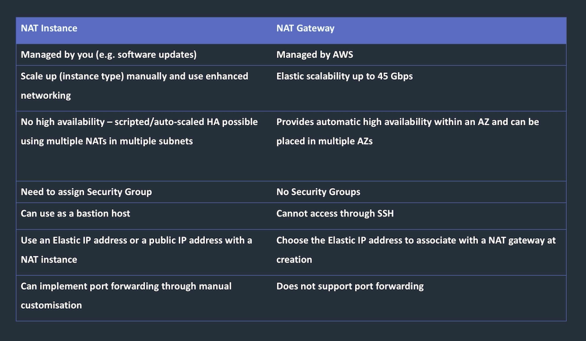

As mentioned above, NAT instance is old school and should be used only for smaller use cases.  

At this stage, we know that the route table of our private instance has only local entries. Let us see how we can set up NAT.  

### Set up NAT Gateway  
 Nat Gateway is hardware you provision in your public subnet,it gets an Elastic IP and you will update your private subnet route table with the NAT gateway address for external routing. 

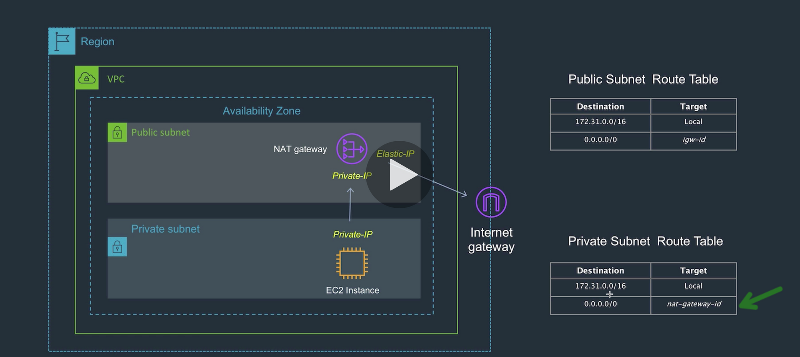

Let us create a NAT gateway. Go to the VPC console and → Create NAT Gateway  

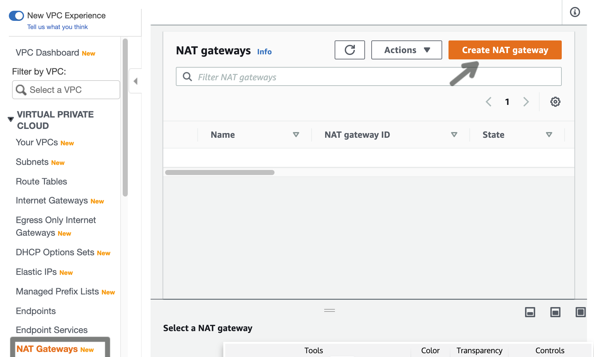

Select a public subnet.  

Now select the route table we created for private route table and add new route.   

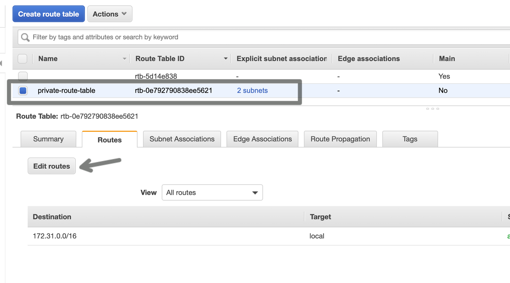

Add NAT Gateway for all non local destinations.  

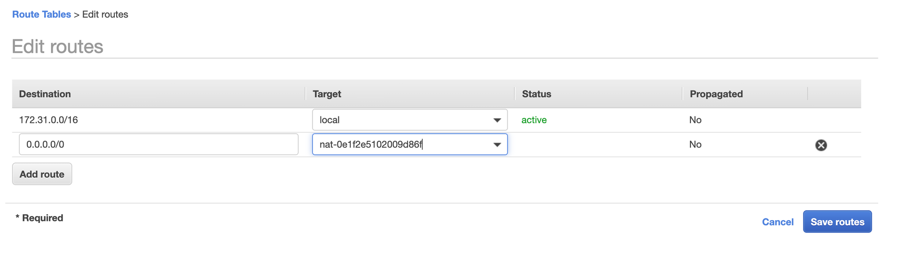

Our new routes for private subnet looks like this.   

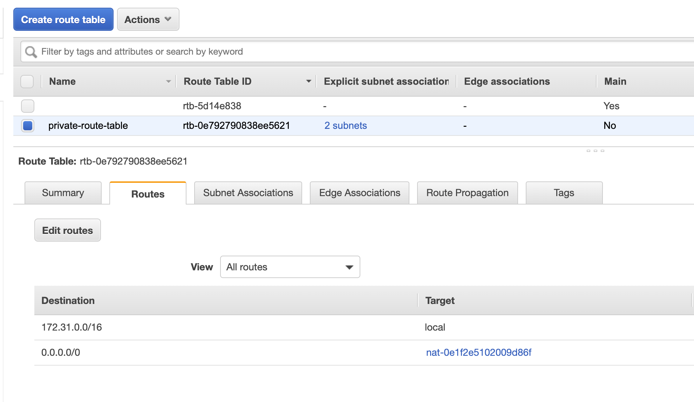

Now let us try to do a ping from our private instance and see.  

### Set up  NAT Instance  

Ensure you delete the NAT Gateway and disassociate the Elastic IP first. Then let us create a new NAT Instance.  (Its basically an EC2 Instance and there are few specific AMI's to be used for NAT Instance). 

Now our route table shows black hole since we don't have NAT Gateway.    

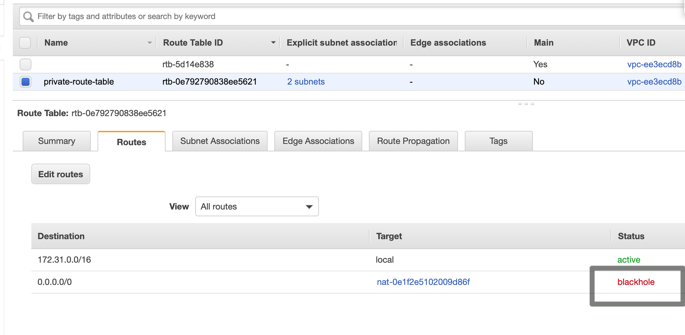  

Now if you ping, it will fail , since no NAT configured in our route table. Let us fix this by creating a NAT instance. 

This would be what we will be doing and we can also use this NAT Instance as a jump host too.

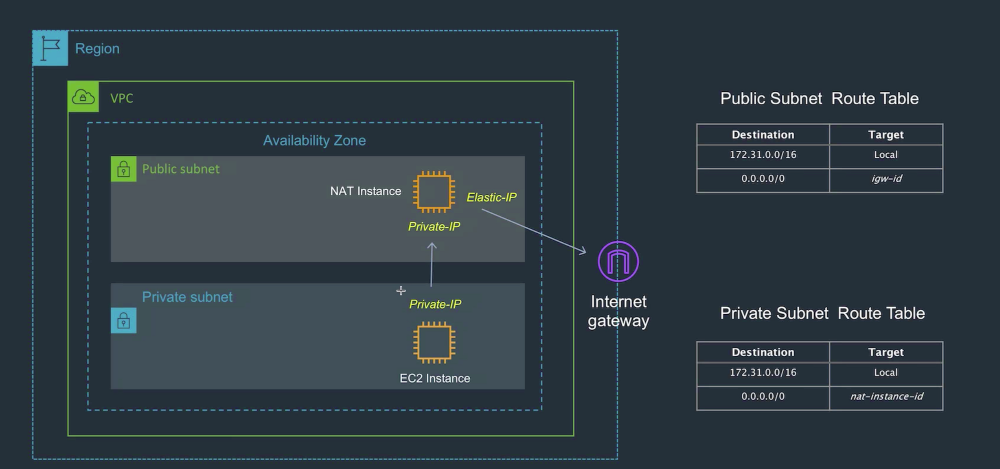  

Launch Instance → Community AMI  

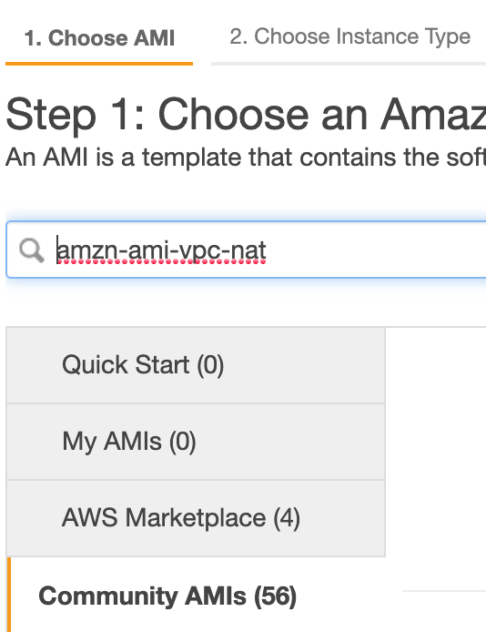  

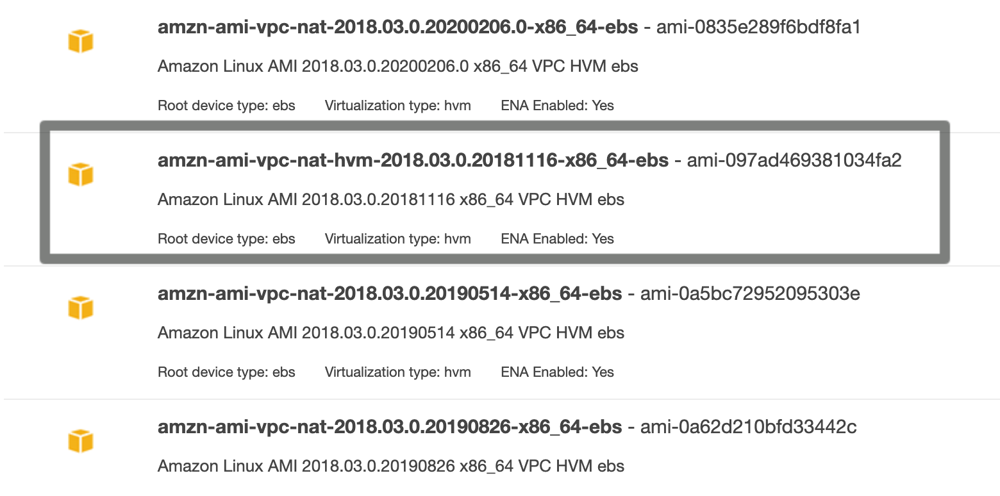  

We need port forwarding for this to work , so go to the new instance you created (ensure in public subnet).  

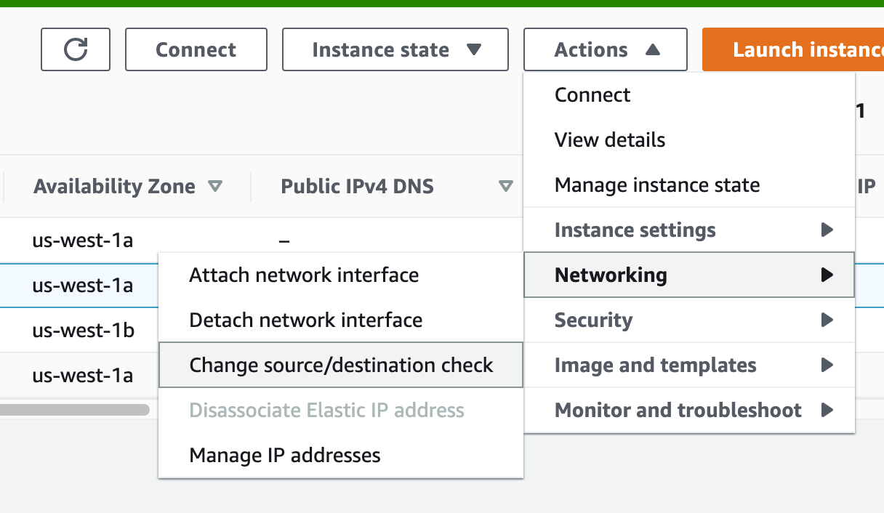  

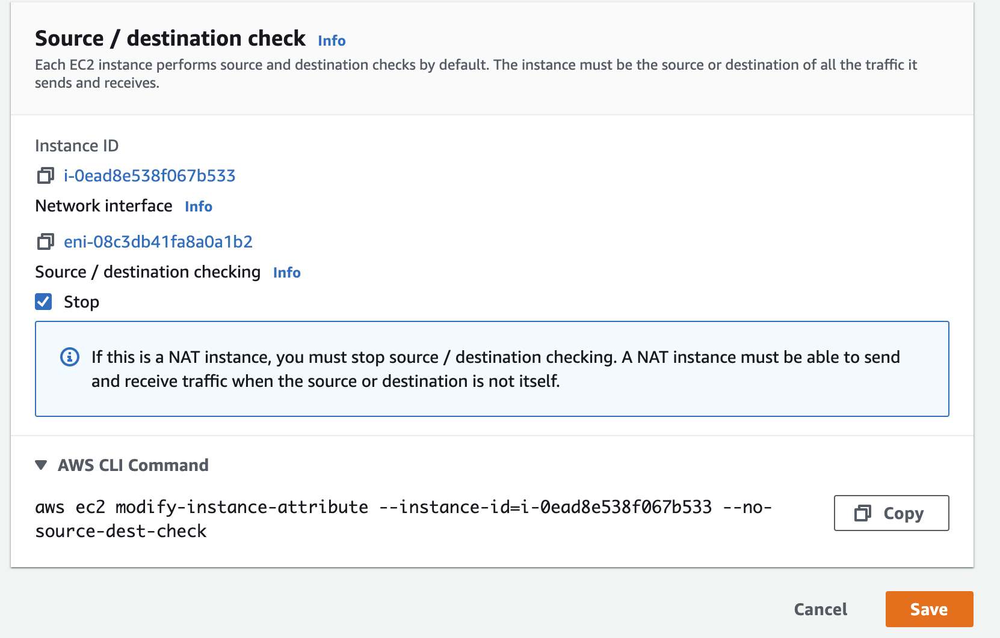  

Now note down the instance ID and edit route table of your private instance and provide the instance id of the new NAT instance we created.  

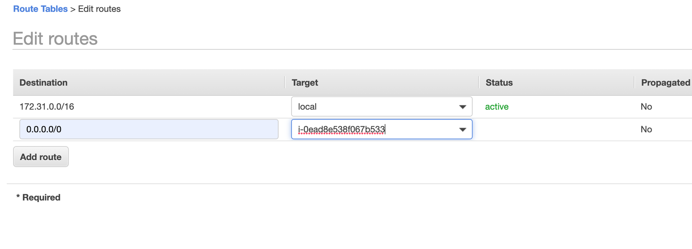  

Ensure you provide ping support in inbound rule of the security group you created.  

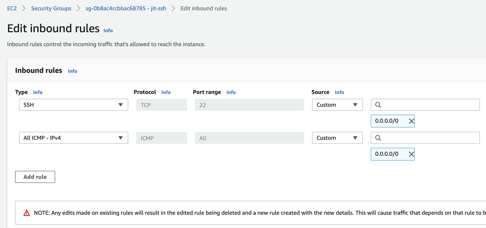  

Now our private instance can ping successfully to outside world using the NAT instance we created.