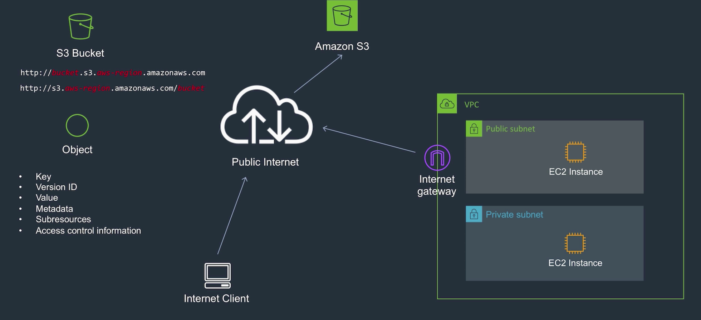
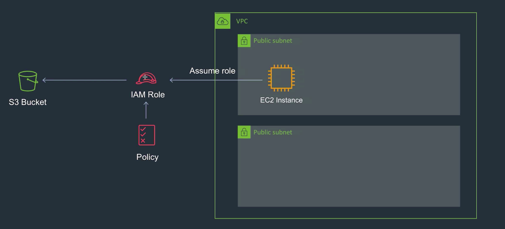
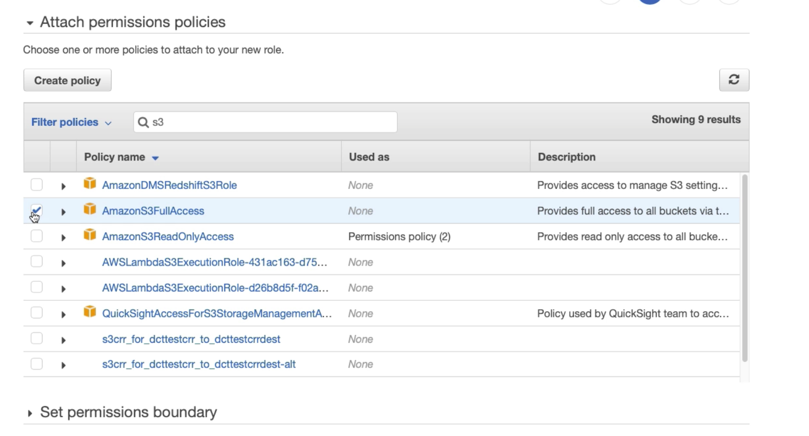
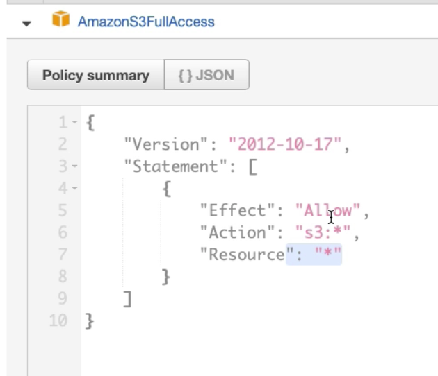
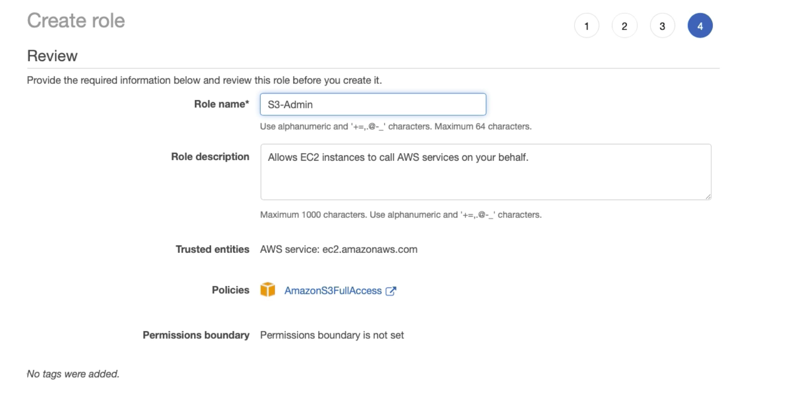
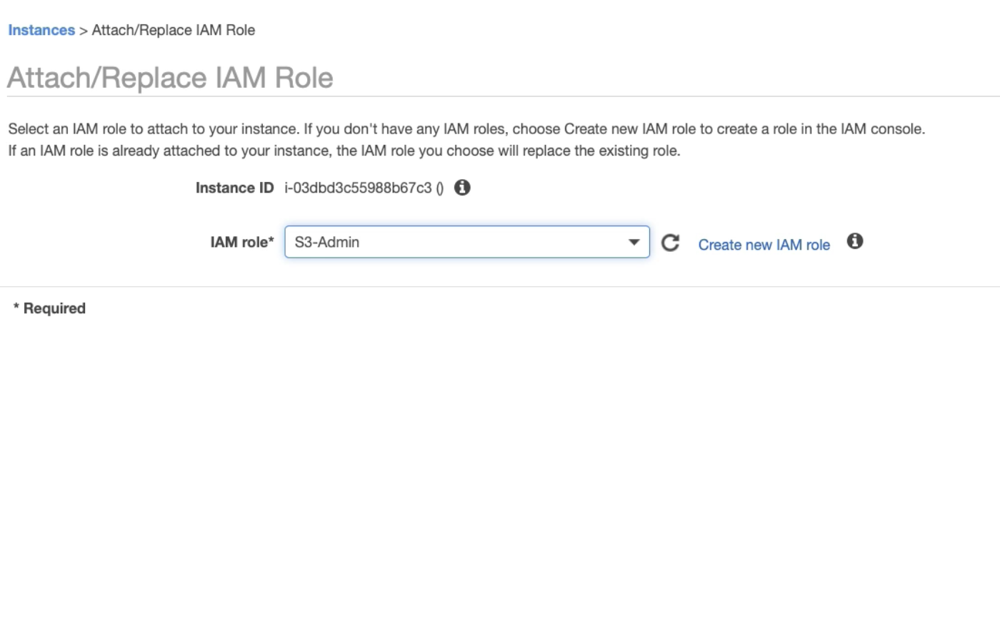
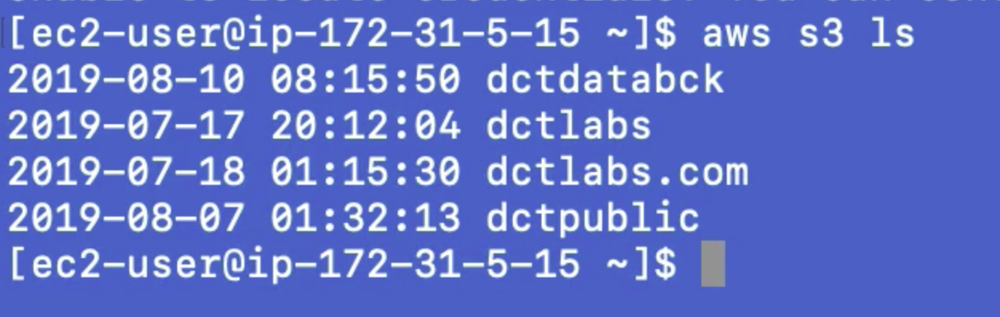

---
layout: post
title: "AWS Essentials : Elastic Load Balancer (ELB)"
description: "AWS ELB"
date:   2020-01-08
tags: [AWS]
comments: false
references: [
   "Iam : https://aws.amazon.com/iam/",
   
]
---  

In this post, we will discuss about AWS Elastic Load Balancer (ELB), various types of Load Balancers and how to configure them.  

Let us consider a scenario in which you have an S3 Bucket and your EC2 instance needs to access the S3 Bucket.  The quickest and dirtiest way to do this is to store the access keys in EC2 instance and access the buckets. 

Given below shows how to store the AWS credentials in EC2 Instance and then access the S3 bucket.

The drawback with this approach is your AWS key pairs are out in the EC2 instance and not secure.  

  

So best way to do this is to create a role with a policy to read the S3 buckets and assign the role to EC2 Instance. So when EC2 requires to access the S3 Bucket, it will assume this role and requests a temporary credentials and access the S3 bucket. (No access keys / secrets) are involved.  

  

Go to IAM → Create a Role → EC2→ Select following predefined policy  

  

  

  

Now to EC2 instance → Attach/Replace IAM Role  

  

Now S3 can list the buckets with out storing any key / secrets in it.  

  

Happy Clouding...