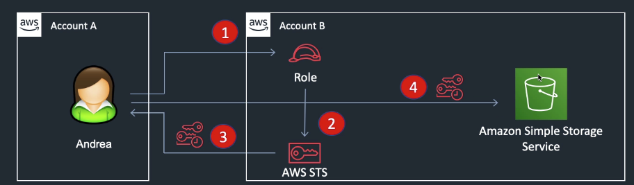

---
layout: post
title: "AWS Essentials : Identity and Access Management(IAM)"
description: "AWS Identity and Access Management"
date:   2020-11-13
tags: [AWS]
comments: false
references: [
   "Iam : https://aws.amazon.com/iam/",
   
]
---  

In this post we are going to discuss some essential topics we need to understand in  AWS IAM.

## IAM Policies  
Policies are documents(JSON) that define permissions that can be applied to users, groups and roles. Given below is a simple policy document that allows to list users in a Cognito User pool.  

Action: List users  
Resource : ARN of the Cognito user pool.

```json
{
    "Version": "2012-10-17",
    "Statement": [
        {
            "Sid": "VisualEditor0",
            "Effect": "Allow",
            "Action": "cognito-idp:ListUsers",
            "Resource": "arn:aws:cognito-idp:us-west-2:3311415502:userpool/us-west-2_fh4MB3Xg7"
        }
    ]
}
```

## IAM Roles  
IAM roles lets you to delegate permissions to resources for users and services.
Let us consider you have a Lambda function that needs to access some records in a DynamoDb table. By default Lambda does not have access to the DynamoDb records. In order for Lambda to access the DynamoDb records, we need to assign a "role" to the Lambda function. The role should have a policy attached to it which specifies the the permission to access the records. There are no credentials associated with a role (password or access keys). In our case Lambda assumes the role to obtain temporary security credentials that can be used to make API calls to fetch records. This temporary credentials are provided through AWS Security Token Service.

## AWS Security Token Service (STS)  
The AWS Security Token Service (STS) is a web service that enables you to request temporary, limited-privilege credentilas for IAM users or users that you authenticate(federated users.)  
By default, AWS STS is available as a global service, and all AWS STS requests go to a single endpoint at *https://sts.amazonaws.com*.  
By default, STS is enable in all regions, but can be disabled if needed. The temporary credentials will always work globally.  


