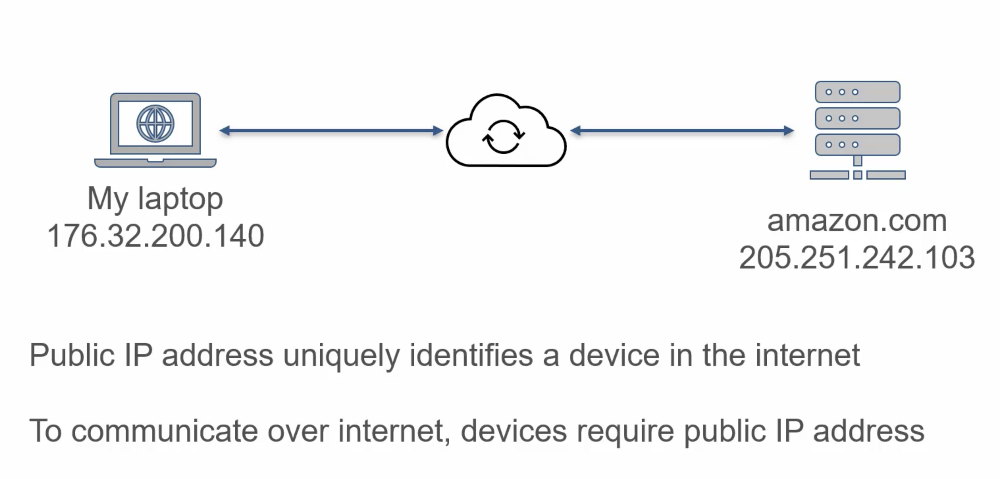
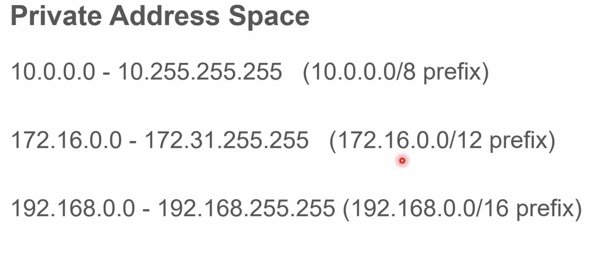

---
layout: post
title: "AWS Essentials : AWS Virtual Private Cloud (VPC)"
description: "AWS Virtual Private Cloud"
date:   2020-01-02
tags: [AWS]
comments: true
references: [
   "Iam : https://aws.amazon.com/iam/",
   
]
---  

Objective of this post is to gain a better understanding on Networking in AWS and gain a deep understanding on VPC in AWS.

* TOC
{:toc}

## IP Subnetting  
IP addresses uniquely identify a device in a network.  IP addresses can be classified as public IP or Private IP. IP addresses discoverable on the internet are called Public IP addresses. Public IP's are globally unique, while private IP is unique within a network. Private IP's are usually assigned to devices in a home/office network.

## Private Address Space 

The consortium that manages IP standards has reserved specific IP address blocks as Private address space. 
