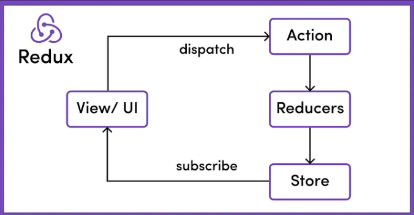

As React applications grow, managing state across multiple components can become complex and difficult to maintain. This is where Redux comes in, providing a predictable state management solution that helps developers maintain consistency across their applications. In this post, we'll explore Redux, specifically using Redux Toolkit, to make our state management simpler and more efficient.  

## Why Redux ?

As you build larger applications in React, you'll find that managing state becomes increasingly challenging. You might start by passing state down from a parent component to child components through props, a technique known as "props drilling." While this works fine for small applications, it quickly becomes unmanageable as your app scales.

Consider a scenario where multiple components across different parts of your application need access to the same piece of state. Passing this state through several levels of the component hierarchy can be cumbersome, error-prone, and hard to debug. This is where Redux steps in.

Redux provides a centralized store for all your state, making state management predictable and easy to debug. With Redux, your application state is stored in a single location, allowing any component to access it directly. Redux's predictable nature means that the state changes only in response to dispatched actions, which makes the behavior of your application more consistent and easier to debug.  

In Redux, the entire state of an application is stored in a single JavaScript object called the “store.” This allows for a centralized and predictable state management system

## Key Concepts in Redux  



### Action
An action is a plain JavaScript object that describes what happened in the application. Every action has a type property, and it may also contain some data (payload).

```js
const incrementAction = {
  type: 'counter/increment',
  payload: 1,
};

```
Think of an action as a message describing something that happened based on a user action, like “Increment the counter by 1

An action is invoked or send using a special function called "Dispatch". 

## Reducer    
A reducer is a function that takes the current state and an action as arguments and returns a new state. Reducers specify how the application’s state changes in response to actions.  

```js 
function counterReducer(state = { value: 0 }, action) {
  switch (action.type) {
    case 'counter/increment':
      return { ...state, value: state.value + action.payload };
    default:
      return state;
  }
}

```
A reducer is like a rulebook that says, “When this action happens, here’s how to change the state.”  

## Store  
The store is the centralized place where the application state is stored. It brings together actions, reducers, and the current state.  

```js 
import { createStore } from 'redux';
const store = createStore(counterReducer);

```
The store is like a warehouse where all the application data is stored and managed.  

## Slice  
A slice is a portion of the Redux state and the logic related to it, usually created using Redux Toolkit’s createSlice function. Usually a slice is related to a feature in your application.  

```js
import { createSlice } from '@reduxjs/toolkit';

const counterSlice = createSlice({
  name: 'counter',
  initialState: { value: 0 },
  reducers: {
    increment: (state) => {
      state.value += 1;
    },
  },
});

export const { increment } = counterSlice.actions;
export default counterSlice.reducer;

```  
As show slice is where we glue together our Initial State, Actions and its corresponding Reducers. In this slice there is only one Action and corresponding Reducer.

## Flow  
When something happens in the app (e.g., a button is clicked), an action is created and dispatched. The reducer receives this action and determines how to update the store. The store then holds the updated state, which the components can access. This flow ensures that the state management in your application is predictable, traceable, and centralized, making it easier to manage complex applications  